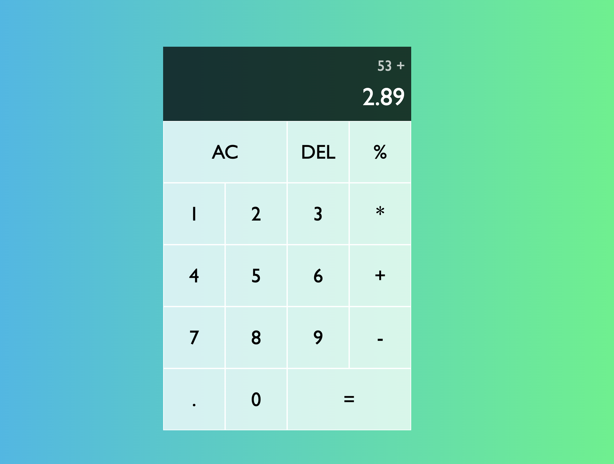

# Javascript_Calculator 🧮

해당 프로젝트는 별 다른 프레임워크나 라이브러리를 사용하지 않고 바닐라 JS, html, css만을 이용하여 계산기를 구현합니다.
아래의 항목들은 각각 html, css, Javascript 파일이 어떤 원리로 구현되었는지를 보여줍니다.

## 📌 index.html

- 우선 전체 요소들은 grid로 구성할 것이므로 최외곽 div의 class를 관련 이름으로 잡습니다.
- 계산기는 크게 결과를 보여줄 부분과 연산자 & 피연산자가 들어갈 부분으로 나뉩니다. 전자는 하나의 div에 넣어주며 후자는 그냥 button 요소를 나열합니다.
- 각 역할을 하는 속성을 요소마다 부여하는데, 이는 Javascript를 통해 DOM 조작으로 pick합니다.
- 속성은 각각 ac, del, 이전의 피연산자, 현재의 피연산자, 연산자, 동등 equal 기호로 나뉩니다.

## 📌 styles.css

- 모든 요소는 box-sizing을 border-box 속성을 적용해 너비와 높이를 직관적으로 조작할 수 있도록 해줍니다.
- 모든 요소를 가지고 있는 최외곽 div는 컨테이너 역할을 하는데, display는 그리드로 합니다. 관련 속성들을 통해서 이를 화면의 중앙에 위치시킵니다.
- grid-template 속성을 통해 열과 행의 개수를 각각 정해줍니다.
- 버튼에 커서가 올라가면 이를 포인터로 바꿔주며, hover 상태의 Psuedo class를 통해 색상을 바꿔줍니다.
- ac나 = 버튼은 다른 버튼들과 다르게 2칸씩 차지하므로 span-two 클래스는 이를 적용합니다.
- previous 피연산자와 current 피연산자를 보여줄 output div는 각각의 요소를 담기 위해서 display 속성을 flex로 설정하고 관련 설정을 맞춰줍니다.

## 📌 script.js

> 본 계산기 프로젝트는 class를 기반으로 구현됩니다. 이때 계산기에는 일종의 상태(state)들이 있다고 생각하면 좋습니다. 실제 표시될 previous 피연산자의 UI, current 피연산자의 UI, previousOperand, currentOperand, operation(연산 상태)입니다.

- html 요소들은 querySelector,querySelectorAll 메서드를 통해 pick해줍니다. 이는 html에서 부여한 속성도 적용할 수 있습니다(관련 코드 참조).
- 나머지 관련 정보는 코드의 주석을 참고하시면서 이해하시면 좋을 것 같습니다.

### 클론을 하면서 느낀 점 ✅

1. 코딩을 하기 이전에, 계산기의 레이아웃을 구상하고 필요한 기능을 생각합니다. 후에 어떤 방식으로 이를 구현할지를 정합니다(class를 이용해서 `this.{메서드}` 방식)
2. 기능을 추가하다보면 연산자가 previousOperand 등에서 누락되는 등의 애로 사항일 생길 수 있습니다. 클래스의 메서드를 작성해주는 방법을 택했기 때문에, 해당 케이스들을 처리해줄 수 있는 초기 조건(early return)문을 통해 이를 개선합니다.
3. Javascript는 사용자와의 인터렉션을 DOM에 반영하기 위한 스크립팅 언어로 시작한 목적이 강했기 때문에, 각 DOM 요소마다 `addEventListener()` 등의 메서드를 이용해 이벤트를 등록해주는 것이 포인트입니다

# 실제 계산기 구현 이미지

